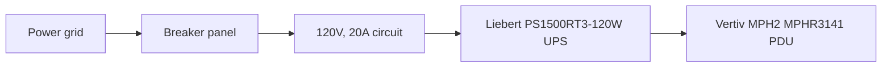
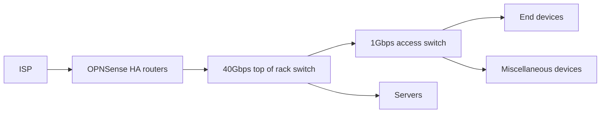
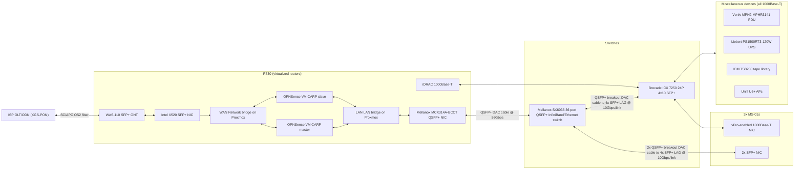

# infra-mk3

This repo is both the documentation of, and (in part) the implementation of, the fourth major iteration of my homelab infrastructure. The primary objective of this implementation is to provide a reliable and stable way for me to develop, practice, and showcase my technical skills.

## Overview
- [infra-mk3](#infra-mk3)
  - [Overview](#overview)
  - [Introduction](#introduction)
  - [Hardware Architecture](#hardware-architecture)
    - [Power](#power)
    - [Network](#network)
      - [Physical layout](#physical-layout)
      - [Virtual/VLAN layout](#virtualvlan-layout)
      - [Route propagation](#route-propagation)
      - [Firewall rules and NAT port forwarding](#firewall-rules-and-nat-port-forwarding)
      - [External DNS](#external-dns)
    - [Storage](#storage)
      - [Persistent storage](#persistent-storage)
      - [Backups](#backups)
    - [Compute](#compute)
      - [VM host](#vm-host)
      - [Kubernetes hosts](#kubernetes-hosts)
  - [Software architecture](#software-architecture)
    - [Workload deployments](#workload-deployments)
    - [Monitoring](#monitoring)
    - [Updates](#updates)
    - [Identity and access management](#identity-and-access-management)
    - [Secrets](#secrets)
    - [Bootstrapping](#bootstrapping)

## Introduction
Over the past 10+ years I've gone through several iterations of my home infrastructure, including both hardware and software. I have made mistakes every time, however, I can confidently say that each major iteration has grown closer to an ill-defined "ideal" design. More importantly, however, I have gained significant knowledge (primarily technical) by building out and maintaining this infrastructure for years. Not only do I enjoy learning and improving my skillset, but this hobby has drastically helped my career development as well.

Here's a high-level overview of some of the major "revisions" of my infrastructure:
* Originally, I manually deployed Windows Server VMs on my desktop with VMWare Workstations. Early on in my career, I worked in a small business environment, managing Windows Desktops, Cisco Meraki-based networks, with a couple of CentOS VMs running on a desktop "server" that lived in a closet somewhere. The knowledge I gained deploying Windows Servers, Active Directory domains, and other assorted services helped the company I worked for deploy backups, setup single sign-on, and build out networks that (to my knowledge) are still in use today. This mitigated risk, improved security, and improved productivity.
* On the second iteration, I ran Linux, Windows, and BSD VMs via VMWare ESXi. This all ran on a couple of seventh-gen HPE DL385s that a coworker was kind enough to give me during a company test environment hardware refresh. These dual processor, 16 core (total) machines with 24 GB of 1333 MHz DDR3 kept homelab running for a couple of years. I ran a OPNSense VM on one as my first non-consumer router (at home), as well as some video game servers for friends. I also ran some Ubuntu VMs for Linux kernel development of an [AT91SAM9XE512](https://mm.digikey.com/Volume0/opasdata/d220001/medias/docus/1048/AT91SAM7X512%2C256%2C128.pdf)-based rocket flight computer for a non-profit company that I co-founded. This infra helped take me from a Linux user to a proper admin. I later put these skills to use for my employer, where I (amongst other projects) rearchitected and migrated the hosting environment for a major e-commerce platform. This resulted in faster, more secure deployments, as  well as higher scalability and reliability. If you live in the US, there is a decent chance that you've used this platform at some point - though you may not recognize the name.
* [The most recent iteration of my homelab infrastructure](https://github.com/soliddowant/infra-mk2) is a pretty major divergence from the last two. When I started out with this version, I decided that I wanted it to be as easy to maintain and reliable as possible. [At a hardware level](https://github.com/solidDoWant/infra-mk2/tree/main/hardware), I (mostly) accomplished this with an assortment of enterprise servers, a NetApp disk shelf, and a Brocade 40Gbps access switch. However the biggest difference isn't the hardware - it's the software. Rather than running VMs, almost all of my workloads run as containers in a Kubernetes cluster. Almost all of the hardware is provisioned with Ansible, and all persistent data can tolerate at least two disk failures without data loss. Most of the workloads can automatically shift between server, so I can perform maintenance (manually or via automation) with minimal interruption. Nearly all changes are recorded via git in the linked repo, and automatically deployed. This makes it easy to tell what changed and when, as well as roll back if necessary. 

  As a result, I run at least ten times as much software on this stack, but with a significantly lower maintenance burden. This allows me to learn about, deploy, and test out lots of different pieces of software that I would potentially use in a production environment. I've scratch-built a similar set of clusters across several environments for my current employer. With this pattern, I am able to manage business-critical services with nearly zero downtime, almost singlehandedly. On top of this, the lessons I've learned from my homelab reduced my employer's (directly measurable) recurring costs by nearly a $1MM/year _last year alone_. This is a non-trivial portion of our annual R&D budget and has quantifiably extended the company's runway.

With my experience with the last three iterations in mind, there are several things that I would like to improve on with this iteration:
* I need (even) higher reliability. I have several workloads that require specific hardware (such as a GPU) to operate. Currently, these workloads can only run on one node. This means when this node fails (which unfortunately is happening with increasing frequency), the workloads also fail.

  Additionally, my OPNSense (router) instance is a single point of failure for basically everything. Updates are always risky because if the instance fails to start, I usually have to recover it from the locally, as my network is effectively torched. I need a second standby instance with automatic failover for when this happens.

  I don't expect to get rid of all internal single points of failure entirely - however, I want to reduce them as much as is feasibly and financially possible.
* I want to improve my data resiliency. Currently all my backups are manual and recovery is often untested. I need to setup automated backups of important data, and I need to be able to store a copy of the most critical data off-site in a location that I control (as in, not a SaaS vendor).
* I need to reduce the power consumption of my hardware. My server rack currently pulls about a kilowatt on average, which ends up enormously expensive. Even if it comes at an increased up-front cost, I need to reduce my rack's power usage.

## Hardware Architecture

The system architecture is broken up into several high-level components. All endpoint devices are out of scope unless explicitly specified. Unless otherwise stated, all hardware lives inside [a 45U fully enclosed server rack](https://assets.belden.com/m/27ebe83e4015e128/original/Rack-Cabinet-Systems-Belden-2019-02.pdf).

### Power

Power delivery in a single point of failure in my lab. I "only" have one power company, breaker panel, circuit, [UPS](https://www.vertiv.com/en-us/products-catalog/critical-power/uninterruptible-power-supplies-ups/ps1500rt3-120w/), and [PDU](https://www.vertiv.com/en-us/products-catalog/critical-power/power-distribution/vertiv-mph2-mphr3141/), all wired in series. The UPS helps protect against short power outages, but if it, the PDU, or device power supplies fail, then at least one device will fail.

Removing any of the single points of failure upstream of the UPS would be prohibitively expensive. I could add another UPS and an automatic transfer switch (ATS) to handle battery and power converter failures, but it's probably not worth the cost. Based on current prices, I could probably get another 1500VA UPS with new batteries, along with an ATS for about $600 to my door. Typically I only have about one power outage per year that lasts for more than 2-3 minutes, and even with older batteries, my UPS can handle this without issue.

I could also add another PDU in parallel with my current PDU, but again, I wouldn't see much benefit for the cost here. Most of the hardware I'm using only has one power supply, so I would either need to add an ATS for each device of these devices. I would also raise my power costs for devices that have multiple power supplies, as each additional supply has a power "overhead" cost when plugged in, even in active/passive configuration.

### Network

#### Physical layout
My network follows a pretty standard tree topology. At a high level, I have my ISP's WAN connected to a virtual switch (bridge) where it is multiplex between two OPNSense router VMs. These routers share another bridge that connects to a 56/40Gbps Mellanox switch via a QSFP+ DAC. The 40Gbps switch connects to a ICX 7150 via QSFP+ to 4x SFP+ breakout DAC, with all four interfaces configured in a Link Aggregation Group (LAG). All other devices are connected to the Mellanox switch for 10, 40, and 56 Gbps links, and the Brocade access switch for 1 Gbps and PoE links.

Despite roughly following a tree topology, there are several uncommon design elements:
* Instead of using my ISP-provided BGW320-505 gateway, I am using a [WAS-110 XGSPON ONT "stick"](https://flyteccomputers.com/halny-networks-hlx-sfpx) to connect to my ISP's network. I do this instead of setting up the ISP-provided gateway in "passthrough mode" for several reasons:
  * It removes a point of failure
  * It consumes *significantly* less power
  * It avoids a hardware limitation with the gateway where it can, at most, track 8192 connections at once (and has performance issues well before that limit)
* I'm running two OPNSense instances as routers. These are configured in a failover group, and use the [Common Access Redundancy Protocol (CARP)](https://docs.opnsense.org/manual/hacarp.html) on internal VLANs high availability. This allows me to change one instance at a time (either a reconfiguration or a software update) without causing an outage. This is a little bit difficult to handle on the WAN interface. My ISP only supplies me with a single dynamic IPv4 address, with a long DHCP lease. This means that the WAN interface of each router in the failover group needs to be the same... but this doesn't work because switch for the WAN will not know which port to send packets to. To work around this, I am running a script, triggered on CARP failover event, that disables the WAN interface on the slave instance, and enables it on the master. This inevitably leads to some packet loss, but works reasonably well.

  There are a few ways that I might try to improve this in the future:
  * I could enable the WAN port of both instances, then use static ARP table entries in the WAN and LAN network bridges. I could then run a service somewhere else (probably my Kubernetes cluster) that would monitor the router status. Upon failure, the service would change the static ARP table entries in the network WAN/LAN network bridges on the underlying OPNSense node. As long as connection state, DHCP server state, etc. replication is configured properly, this should be a near-seamless transition with little packet loss.
  * Right now everything is running on a single OPNSense node. When I want to change something on this node (such as a reboot after a software update), then I will have an internet outage while the host and OPNSense instances reboot. I could mitigate this by adding another OPNSense node, alongside a physical switch for the WAN, and configuring live VM migrations between the Proxmox nodes. This would allow me to update the underlying nodes without an outage, at an increased power cost (which I'm trying to optimize for).
* I have a 56 Gbps Ethernet link between the Proxmox R730XD server and the Mellanox switch. This requires all Mellanox network hardware (NIC, cable, switch). If I remember correctly, it's achieved via a line coding scheme in the physical coding sublayer with less overhead (128b/130b maybe?), alongside hardware with a higher SNR to reduce the bit error rate.
* The Brocade access switch unfortunately does not have any QSFP+ cages, but it does have 8x SFP+ cages. I'm using a squid/breakout DAC cable to establish four separate 10 Gbps links between the switches, combined in a LAG. I also have LAGs with each of the three MS-01 nodes, formed with a pair of 10 Gbps links.
* Not diagrammed is a fiber patch panel with both MPO-8 and LC connectors. Inside/behind the panel, there are splitter cables that split fiber pairs from the MPO-8 connectors to 4x LC connectors. I then run LC UPC OM3 from this patch panel to various devices throughout my home.

Here's the network in more detail:

As shown above, there are still several single points of failure with this design. Most of these I could easily mitigate by adding additional hardware (switches, VM host) and changing the topology a bit. Devices would connect to two switches instead of one, and form a multi-chassis LAG (MLAG) with the links. If I deployed another VM host, then I could live-migrate router VMs for zero-downtime updates, and I could tolerate a single host hardware failure. Lastly, I could add another ISP for a multi-WAN setup,  buy a block of IP addresses, and setup multicast BGP peering with the ISPs.

#### Virtual/VLAN layout

My physical network is subdivided into several virtual LANs (VLANs) spreading across the physical and virtual routers and switches.

| ID  | Name          | Description                                                                                                       | IP ranges                                                                   |
| --- | ------------- | ----------------------------------------------------------------------------------------------------------------- | --------------------------------------------------------------------------- |
| 100 | Management    | Out of band management (iDRAC, vPro) and hypervisor access (Proxmox web interface)                                | 10.0.0.0/16                                                                 |
| 200 | Hosts         | Primary network access for machines that run workloads, used for SSH, WAN access, k8s control plane traffic, etc. | 10.1.0.0/16                                                                 |
| 300 | Kubernetes    | CNI traffic between k8s pods                                                                                      | 10.2.0.0/16 (BGP), 10.43.0.0/16 (pod to pod), 10.44.0.0/16 (load balancers) |
| 400 | Infra devices | Infrastructure devices (UPS, PDU, etc.)                                                                           | 10.3.0.0/16                                                                 |
| 500 | User devices  | End user devices (desktops, laptops, etc.)                                                                        | 10.4.0.0/16                                                                 |
| 600 | Guest devices | End user guest devices, less trusted with only Internet access and network segregation (PVLAN)                    | 10.5.0.0/16                                                                 |
| 700 | IoT devices   | Untrusted IoT devices with limited point to point internal access (PVLAN)                                         | 10.6.0.0/16                                                                 |

All VLANs that don't use a private VLAN (PVLAN) have the first half of their address space dedicated to static IPs, with DHCP handling the second half. The exception is the 10.43/16 and 10.44/16 ranges, which are entirely static.

#### Route propagation

Kubernetes pods may be scheduled on multiple nodes, and load balancer virtual IP addresses need to be reachable from several nodes. All nodes running Cilium (Kubernetes CNI) have BGP peering setup with the routers. Pod and load balancer IP addresses are announced from all nodes in the cluster.

Unfortunately, [Cilium doesn't support BFD yet](https://github.com/cilium/cilium/issues/22394). When/if BFD support is added, I will deploy it. For now, I just have to accept packet loss when a node goes offline.

#### Firewall rules and NAT port forwarding

OPNSense firewall rules and NAT port forwarding are handled via a custom OPNSense controller running inside the cluster. Custom resources and load balancers with specific annotations can allow external traffic flow through the router and firewall to Kubernetes services.

#### External DNS

I have a publicly-resolvable domain resolving to my WAN IP address. Because my IP address is dynamic (although it changes infrequently), I have custom tooling update this A record periodically. The external DNS project is used to manage records that should resolve to specific services within my cluster.

DNS records are pushed to Cloudflare for public resolution. Internally, I'm using a custom webhook provider for external DNS that syncs records with Unbound, which runs on my OPNSense routers.

### Storage

Storage is broken down into two categories: ephemeral and persistent. Ephemeral storage can be lost/corrupted/destroyed without consequence, as long as it isn't a single point of failure. All Kubernetes nodes use a cheap consumer NVMe SSD as their OS disk, and for persistent storage. If a drive starts to fail, I can simply take the node offline and replace the failing part. The server running the router VMs needs to be a little more fault tolerant as it's a single point of failure. This server uses a pair of WD BLACK SN850X consumer SSDs in a ZFS mirror pool. These SSDs are a little nicer than what I'm using in my Kubernetes nodes, and (anecdotally) I've had them work flawlessly for years in a similar environment.

#### Persistent storage

Persistent storage is much more important. Not only should it tolerate several drive failures before data loss, but it needs to be backed up as well. I have two forms of persistent storage for day-to-day operations: a NetApp DS4246 disk shelf for bulk storage, and a Ceph cluster for fast storage.

The disk shelf is attached to the Proxmox host via a LSI 9207-8e host bus adapter (HBA). The disk shelf's IO modules (IOM) are both connected to the HBA. The HBA is passed through to a VM that configures the eight SAS 12 8TB drives in a ZFS RAID-Z2 pool. ZFS can access the drive with an active-active multipath connection, which both allows for a faster link speed, and can handle one cable or IOM failure. With this design, only the ZFS host itself and the HBA are single points of failure.

The ZFS pool also employs a mirrored pair of 58GB Intel 800P Optane drives for SLOG. This drastically improves performance with sync writes, which NFS makes heavy use of. The datasets in the pool are exposed to the network either by NFS (for most of the storage), or via iSCSI, managed by [democratic-csi](https://github.com/democratic-csi/democratic-csi) for Kubernetes. This is primarily used for media storage, and Kubernetes workloads that require a lot of unshared, slow storage (such as log scrapers).

Ceph (managed by Rook within the Kubernetes cluster) is used for fast, durable storage for cluster workloads. The cluster can tolerate up to two drive failures before losing data. Each node in the cluster includes a Samsung 1.92TB PM9A3 enterprise U.2 SSD. While these are fairly fast SSDs, the critically important part is that they include "power loss protection" (PLP). Despite the name, this feature gives little benefit when there is a power outage. Instead, it allows the drives to report "success" on sync writes significantly faster than consumer drives. This is because data from sync writes can be stored in fast(er), volatile RAM, and still be guaranteed to be written to the disk (synced) in all cases. Most if not all Ceph writes are `sync` writes, so this is key to ensuring that the drives perform well. Without this, even high end SSDs perform like hard drives when used in a Ceph cluster.

#### Backups

Data on important Ceph in-cluster volumes is backed up to a ZFS dataset on the Proxmox host via [Stash](https://stash.run/). This ZFS dataset is accessible via a NFS share that Stash mounts in backup pods. After a backup occurs, a snapshot of the ZFS dataset is taken. This solution allows for:
* Point in time recovery of workloads
* Selective backups of specific paths within volumes
* Direct file access to the backups (many other solutions require an object store)
* Compression of backup data
* Incremental backups with support for deletion of old backups

Periodically, backups of ZFS datasets are written to LTO tape via an IBM TS3200 tape library. Backup files are written, via custom tooling, to tapes "formatted" with Linear Tape File System (LTFS). Backups are typically incremental, with an infrequent full backup. When full backups are taken, an additional tape copy is made, and taken offsite.

This procedure satisfies the [3-2-1 backup rule](https://www.backblaze.com/blog/the-3-2-1-backup-strategy/).

### Compute

I currently have four physical hosts. One R730XD running Proxmox, and three MS-01 running Talos. Hostnames follow the format `$OS-$PURPOSE-$NUMBER`. For the four current hosts, these are:
* `proxmox-vm-host-01`
* `talos-k8s-mixed-0{1,2,3}` (mixed referring to the node running both the control plane, and workloads)

All hosts have two network interface groups of one or more interfaces. The first one is an out of band management port (iDRAC, vPro), and the second is a trunk port for OS and application network traffic.

#### VM host

The VM host runs Proxmox as a hypervisor and uses a pair of Intel Xeon E5-2667 v4 8 core/16 thread processors running at 3.2 GHz. It has 256 GB of ECC DDR4 clocked 2400 MT/s split between the hypervisor and VMs. It includes a number of PCIe cards:
* A LSI 9207-8e SAS HBA connected to the NetApp disk shelf
* A Qlogic QLE2562 fiber channel HBA connected to the IBM TS3200 tape library
* A Mellanox ConnectX 3 Pro MCX314A-BCCT dual QSFP+ NIC connected to the Mellanox switch
* A Dell NVMe Enablement kit P31H2 connected to the last for drive slots of the R730XD backplane, which contains two OS and two ZFS SLOG NVMe drives via NVMe to U.2 adapter

#### Kubernetes hosts

All three current dedicated Kubernetes hosts are identical. They are all [Minisforum MS-01](https://store.minisforum.com/products/minisforum-ms-01) small form factor PCs. Each one is equipped with an Intel i9-13900H 14 core/20 thread processor with up to a 5.4 GHz clock. The RAM is comprised of two 48 GB DDR5 modules at 5200 MT/s. All three nodes use generic M.2 NVMe drives for boot (without a mirror), and contain a Samsung 1.92TB PM9A3 enterprise U.2 SSD exclusively for Ceph. The nodes are connected with three interfaces to the netweork: one 1000Base-T port for vPro access, and two SFP+ cages forming a LAG.

## Software architecture

Most of my workloads run on Kubernetes. A small handful of workloads that cannot be containerized are ran as VMs. This includes OPNSense router instances, and Kubernetes nodes with specific hardware and kernel requirements. Proxmox is used as a hypervisor for these VMs.

Kubernetes nodes run Talos for an immutable operating system. They use containerd as a container runtime by default, and Kata Containers where more isolation is needed. Cilium CNI handles pod to pod and service networking, configured with native routing and BGP peering with OPNSense. Rook Ceph CSI is used for fast, small, highly available storage, and democratic-csi is used with the `zfs-generic-iscsi` driver slow, large, fallible storage. A NFS share, backed by a ZFS dataset, is used for large files that may need to be accessed outside of the cluster, such as media files.

### Workload deployments

After cluster bootstrapping is complete, Flux CD handles the software lifecycle for all cluster workloads. Except for one-off testing changes, all workload changes are committed to this repo. Upon commit to master, GitHub notifies Flux via a webhook of the change, and Flux deploys it. Where possible, bootstrap resources are "adopted" by Flux after initial deployment, so that it can automatically handle updates and changes to them. This structure allows for an easily redeployable cluster, as well as a complete history of all changes, and rollback support.

### Monitoring

Monitoring is handled via Victoria Metrics with Grafana for visualization. Alerts (enabled conservatively) are sent to a private Discord channel. Metrics and logs are stored on bulk ZFS-backed storage with compression enabled, and a ZFS SLOG to help with the frequent sync writes.

### Updates

All dependencies within the repo are handled via Renovate. Renovate runs in "self-hosted" mode as a cron job within the cluster. Unfortunately, I only have one cluster available so I am not able to implement a QA/staging/production split for update PRs, so update PRs are deployed on a "merge and pray" basis. Many updates are automatically merged, although this maintenance reduction comes at a greatly increased risk of a supply chain attack.

Host OS updates are handled via system-upgrade-controller, which ensures that nodes match the OS version specified in the repo (which is managed by Renovate). Additional tooling is needed to handle auto updates of Proxmox and OPNSense nodes (along with rollback on failure).

### Identity and access management

User identities are managed with Authentik. In most cases, Authentik also handles authorization and authentication for web applications as well. Teleport Enterprise is used for access to "infra" level access (such as SSH) for both admin access, and machine to machine access (such as democratic-csi to zfs host SSH).

Unfortunately Authentik does not currently have a k8s operator, so configuration is handled via configmaps that k8s-sidecar dynamically loads into the Authentik pod.

### Secrets

All secret values are stored in the repo via SOPS and encrypted with AGE. Flux can then access and decrypt these secrets, and pass them where needed.

### Bootstrapping

Bootstrapping is handled via Taskfile scripting where possible, otherwise, it is done manually and documented thoroughly. After bootstrapping is complete, Taskfiles are only used to make periodic, one-off tasks (typically for development) more convenient, and is not used for day to day operations.

<!-- * HW
  * Single points of failure
    * proxmox node
    * ~~router~~
    * internet
    * power
    * location
    * switches
* Bootstrapping
  * local
  * remote
    * Run on every change?
* Architecture
  * taskfile to run commands, including bootstrap
    * ansible where needed(?)
    * only do one-off provisioning with ansible or taskfile, write controller to add/remove ports from opnsense, nat rules, etc
  * sops + age for any sensitive values/secrets
  * proxmox, talos, opnsense
    * two opnsense VMs with CARP on internal interfaces + WAN failover script with same mac on both nodes
  * cilium for cni
  * ceph, democratic-csi for csi
  * no kube-vip
* Renovate
* gitops -->