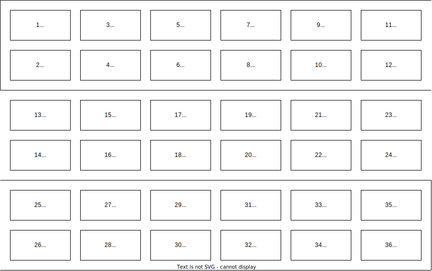

# Relevant links:
* [Initial setup manual](https://network.nvidia.com/related-docs/user_manuals/1U_HW_UM_SX60XX.pdf)
* [Full docs](https://delivery04.dhe.ibm.com/sar/CMA/XSA/MLNX-OS_VPI_v3_4_3002_UM.pdf)
* [Dell EMC branded version to generic Mellanox OS conversion](https://docs.google.com/document/d/1SS0_70PSD5NZDxMy-B---4X1i_2WiLoe)

# Factory reset

After first receiving my switch, I reset it to factory defaults by doing the following:

1. Connect your local computer to the RS232 console port on the switch. This requires both a RJ-45 to DB9 cable (with the correct pinout), and a RS232 cable. Note that the switch uses proper RS232, and a 3V3 or 5V0 UART converter will fail (perhaps catastrophically) if connected to the DB9 connector. No side channel flow control signals are required.
2. Boot the switch.
3. Connect to the switch via a terminal program, i.e. `minicom -D /dev/ttyS3 -b 9600`. The bus should be configured as follows:
   
   ```yaml:
   Baud rate: 9600
   Data bits: 8
   Stop bits: 1
   Parity: None
   Flow Control: None
   ```

   This is a pretty common/standard set of defaults for serial connections.
4. Press the `RST` button on front of the switch, under the LEDs, for _at least_ 15 seconds.
5. Wait for reboot. This will take a few minutes.
6. Log in. The default username/password is `admin` and `admin`. The first login will take several more minutes for initialization.

# Initial management configuration

After factory reset, the switch needs to be configured for remote management.

> [!NOTE]
> If the switch does not have an Ethernet license already loaded, [the licensing steps](#load-licenses) may need to be performed manually via console interface, prior to configuring for Ethernet network management.

Manually run the following over the console interface, after logging in (default credentials are `admin/admin`). This enables remote management via the top 1000Base-T port on the front of the switch:
```shell
# Enter configuration mode
enable
configure terminal

# Disable DHCP
no interface mgmt0 dhcp

# Set a static IP address for the interface
interface mgmt0 ip address 10.0.0.2 255.255.255.0

# Save the config
configuration write
```

Later steps will join this port to the management PVLAN.

# Port configuration and VLAN assignment

| Port   | Split | Untagged VLAN | Tagged VLANs | LAG number | Host name          | Host port            | Cable type | Link speed |
| ------ | ----- | ------------- | ------------ | ---------- | ------------------ | -------------------- | ---------- | ---------- |
| 1/2    | No    | 200           | all          |            | proxmox-vm-host-01 | QSFP+ 1              | DAC        | 56 Gbps    |
| 1/9    | Yes   |               |              |            |                    |                      | DAC        |            |
| 1/9/1  |       | 200           | 300          | 1          | talos-k8s-mixed-01 | SFP+ 1               |            | 10 Gbps    |
| 1/9/2  |       | 200           | 300          | 2          | talos-k8s-mixed-02 | SFP+ 1               |            | 10 Gbps    |
| 1/9/3  |       | 200           | 300          | 3          | talos-k8s-mixed-03 | SFP+ 1               |            | 10 Gbps    |
| 1/9/4  |       | 200           | 300          | 4          | talos-k8s-mixed-04 | SFP+ 1               |            | 10 Gbps    |
| 1/10   | Yes   |               |              |            |                    |                      | DAC        |            |
| 1/10/1 |       | 200           | 300          | 1          | talos-k8s-mixed-01 | SFP+ 2               |            | 10 Gbps    |
| 1/10/2 |       | 200           | 300          | 2          | talos-k8s-mixed-02 | SFP+ 2               |            | 10 Gbps    |
| 1/10/3 |       | 200           | 300          | 3          | talos-k8s-mixed-03 | SFP+ 2               |            | 10 Gbps    |
| 1/10/4 |       | 200           | 300          | 4          | talos-k8s-mixed-04 | SFP+ 2               |            | 10 Gbps    |
| 1/27   | Yes   |               |              |            |                    |                      | DAC        |            |
| 1/27/1 |       | 500           |              |            | User devices       | Patch panel LC fiber |            | 10 Gbps    |
| 1/27/2 |       | 500           |              |            | User devices       | Patch panel LC fiber |            | 10 Gbps    |
| 1/27/3 |       | 500           |              |            | User devices       | Patch panel LC fiber |            | 10 Gbps    |
| 1/27/4 |       | 500           |              |            | User devices       | Patch panel LC fiber |            | 10 Gbps    |
| 1/28   | Yes   |               |              |            |                    |                      | DAC        |            |
| 1/28/1 |       | 500           |              |            | User devices       | Patch panel LC fiber |            | 10 Gbps    |
| 1/28/2 |       | 500           |              |            | User devices       | Patch panel LC fiber |            | 10 Gbps    |
| 1/28/3 |       | 500           |              |            | User devices       | Patch panel LC fiber |            | 10 Gbps    |
| 1/28/4 |       | 500           |              |            | User devices       | Patch panel LC fiber |            | 10 Gbps    |
| 1/32   | Yes   |               |              |            |                    |                      | DAC        |            |
| 1/32/1 |       | 500           |              |            | User devices       | Patch panel LC fiber |            | 10 Gbps    |
| 1/32/2 |       | 500           |              |            | User devices       | Patch panel LC fiber |            | 10 Gbps    |
| 1/32/3 |       | 500           |              |            | User devices       | Patch panel LC fiber |            | 10 Gbps    |
| 1/32/4 |       | 500           |              |            | User devices       | Patch panel LC fiber |            | 10 Gbps    |
| 1/33   | Yes   |               |              |            |                    |                      | DAC        |            |
| 1/33/1 |       |               | all          | 5          | switch-02          | SFP+ 1               |            | 10 Gbps    |
| 1/33/2 |       |               | all          | 5          | switch-02          | SFP+ 2               |            | 10 Gbps    |
| 1/33/3 |       |               | all          | 5          | switch-02          | SFP+ 3               |            | 10 Gbps    |
| 1/33/4 |       |               | all          | 5          | switch-02          | SFP+ 4               |            | 10 Gbps    |

Splitting ports disables others as documented below:



# Load licenses

# Firmware upgrade
The general process for upgrading the firmware is documented [here](https://docs.google.com/document/d/1SS0_70PSD5NZDxMy-B---4X1i_2WiLoe). Here are the specific steps I took to upgrade the firmware:

1. Download required files:

   ```shell
   task setup:sx6036:download-all-firmware
   ```
